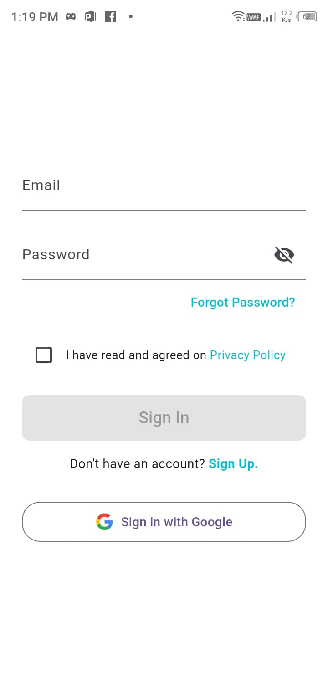
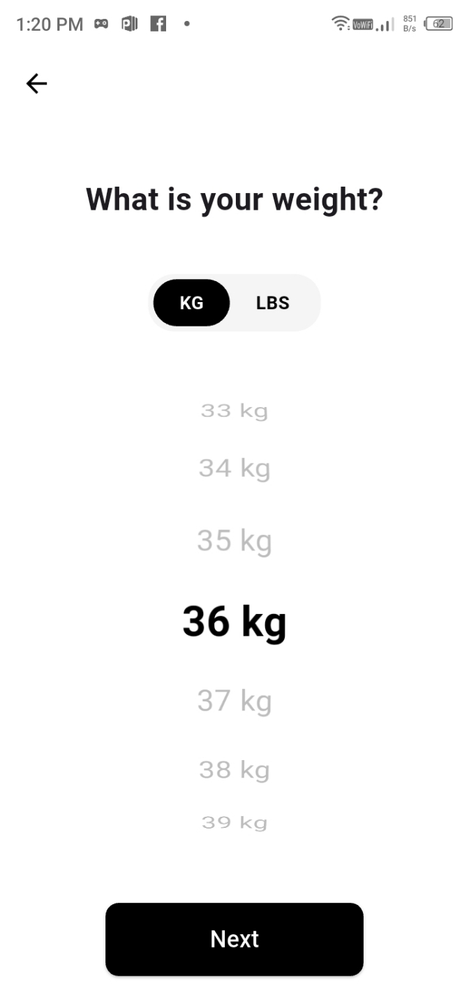
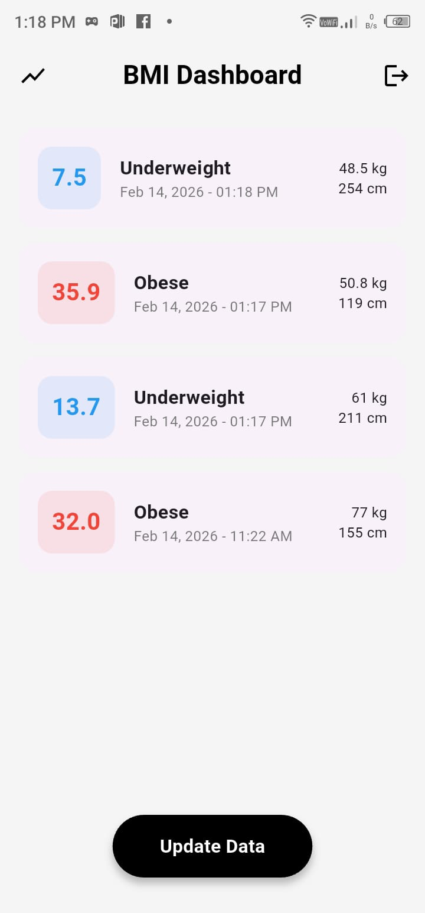
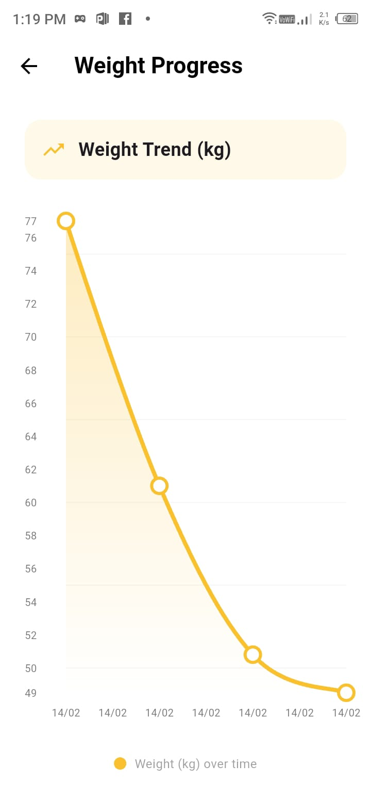

# BMI Tracker 🏋️‍♂️

A professional and feature-rich BMI (Body Mass Index) tracking application built with Flutter and Firebase. This app helps users monitor their health journey through intuitive data input, real-time calculations, and visual progress tracking.

## 🚀 Features

- **Dynamic Splash Screen**: Animated logo and text entry for a premium first impression.
- **Secure Authentication**:
  - Email & Password Sign Up/In.
  - Google One-Tap Sign-In.
  - Password Reset via email link.
  - Session persistence (stay logged in).
- **Personalized Onboarding**:
  - Smart BMI setup flow (Gender, DOB, Weight, Height).
  - Remembers fixed data (Gender/DOB) for returning users.
- **Interactive Dashboard**:
  - Real-time BMI history list.
  - Visual categorization (Underweight, Normal, Overweight, Obese) with color coding.
- **Progress Visualization**:
  - Beautiful Weight Trend Graph using `fl_chart`.
  - Date-based progress tracking.
- **Modern UI/UX**:
  - Full support for **Light and Dark modes**.
  - Smooth slide and fade transitions between screens.
  - Saffron-themed loaders and Material 3 design components.
  - Unit switching (KG/LBS and CM/IN).

## 📖 How to Use

1. **Authentication**: 
   - Open the app and wait for the dynamic splash screen to finish.
   - Sign up with your name, email, and password, or use the **Google Sign-In** button for a quicker entry.
   
2. **Initial Setup**:
   - On your first login, the app will guide you through a setup process.
   - Select your **Gender** and **Date of Birth** (these are fixed once set).
   - Use the vertical scroll wheels to select your current **Weight** and **Height**. 
   - You can toggle between **KG/LBS** and **CM/IN** at any time.
   
3. **Calculating BMI**:
   - After entering your data, tap **Calculate**.
   - Your BMI result will be displayed with a color-coded category and a health tip.
   
4. **Dashboard & History**:
   - Tap **Go to Dashboard** to see your calculation history.
   - Each entry shows your BMI, category, weight, height, and the exact date/time of the record.
   
5. **Tracking Progress**:
   - Tap the **Graph Icon** in the top-left corner of the dashboard to visualize your weight trend over time.
   
6. **Updating Measurements**:
   - As your weight or height changes, tap the **Update Data** button at the bottom of the dashboard to add a new record.

## 🛠 Tech Stack & SDKs

- **Frontend**: [Flutter SDK](https://flutter.dev/) (Dart)
- **Backend**: [Firebase Core](https://firebase.google.com/)
- **Authentication**: [Firebase Auth](https://firebase.google.com/docs/auth) & [Google Sign-In](https://pub.dev/packages/google_sign_in)
- **Database**: [Firebase Realtime Database](https://firebase.google.com/docs/database)
- **Charting**: [fl_chart](https://pub.dev/packages/fl_chart)
- **Native Integration**:
  - [flutter_launcher_icons](https://pub.dev/packages/flutter_launcher_icons) (App Icon generation)
  - [flutter_native_splash](https://pub.dev/packages/flutter_native_splash) (Seamless launch experience)

## 📸 Screenshots & Demo

### Screenshots
|            Sign In            |          BMI Setup          |              Dashboard              |       Progress Graph        |
|:-----------------------------:|:---------------------------:|:-----------------------------------:|:---------------------------:|
|  |  |  |  |

### Video Demo
[Click here to view the demo video](assets/demo.mp4)

## ⚙️ Getting Started

1. **Clone the repository**:
   ```sh
   git clone https://github.com/your-username/bmi_tracker.git
   ```
2. **Install dependencies**:
   ```sh
   flutter pub get
   ```
3. **Firebase Configuration**:
   - Add your `google-services.json` (Android) and `GoogleService-Info.plist` (iOS) to the respective directories.
   - Ensure Email/Password and Google Sign-in are enabled in your Firebase Console.
4. **Run the app**:
   ```sh
   flutter run
   ```

## 📜 License
This project is licensed under the MIT License - see the [LICENSE](LICENSE) file for details.
